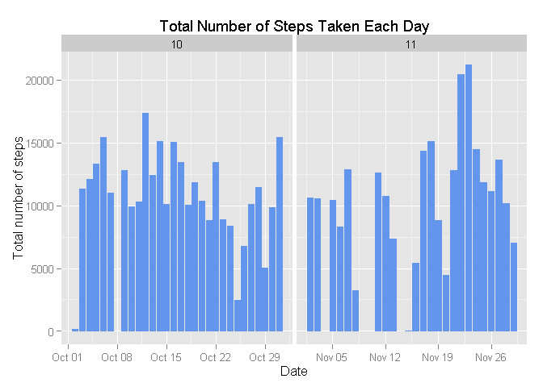
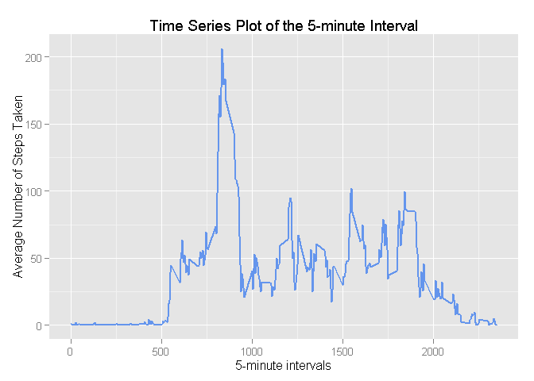
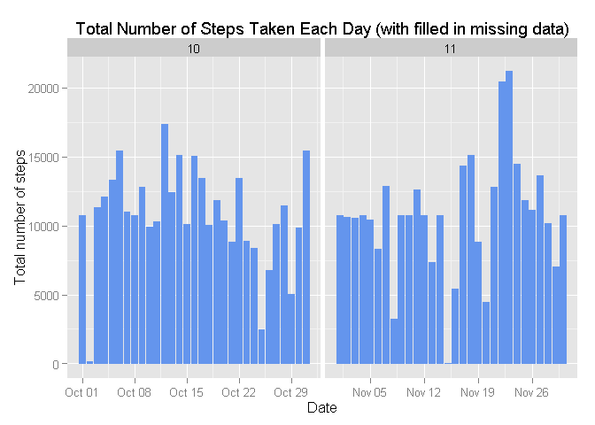
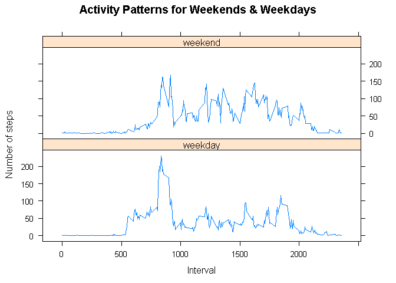

# Reproducible Research: Peer Assessment 1

## Introduction


```r
echo = TRUE  # to make sure that the code is always visible
options(scipen = 1)  # Suppressing Scientific Notation. Normally, R prints "1e+05" rather than "100000" 
                     # because the former takes only 5 characters, while the latter takes 6, and 5 < 6.
```

## Loading and preprocessing the data


```r
fileUrl <- "https://d396qusza40orc.cloudfront.net/repdata%2Fdata%2Factivity.zip"
dataFile <- tempfile()
download.file(fileUrl, dataFile)
data <- read.csv(unz(dataFile, "activity.csv"), colClasses = c("integer", "Date", "factor"))
unlink(dataFile)

(dateDownloaded <- date())
```

```
## [1] "Sun Oct 18 17:09:11 2015"
```

```r
data$month <- as.numeric(format(data$date, "%m"))
OmitNAdata <- na.omit(data) ##  incomplete cases removed
rownames(OmitNAdata) <- 1:nrow(OmitNAdata)
head(OmitNAdata)
```

```
##   steps       date interval month
## 1     0 2012-10-02        0    10
## 2     0 2012-10-02        5    10
## 3     0 2012-10-02       10    10
## 4     0 2012-10-02       15    10
## 5     0 2012-10-02       20    10
## 6     0 2012-10-02       25    10
```

```r
dim(OmitNAdata)
```

```
## [1] 15264     4
```

_Note that 'echo = TRUE' is used to make sure that the code is always visible_.

## What is mean total number of steps taken per day?

For this part of the assignment,  missing values are ignored.
- Make a histogram of the total number of steps taken each day


```r
library(ggplot2)

ggplot(OmitNAdata, aes(date, steps)) + geom_bar(stat = "identity", colour = "cornflowerblue", fill = "cornflowerblue", width = 0.8) + facet_grid(. ~ month, scales = "free") + labs(x = "Date", y = "Total number of steps", title = "Total Number of Steps Taken Each Day")
```

 

- Calculating and reporting the mean and median of thetotal number of steps taken per day.

#### Mean number of steps taken per day

```r
totalSteps <- aggregate(OmitNAdata$steps, list(Date = OmitNAdata$date), FUN = "sum")$x
mean(totalSteps)
```

```
## [1] 10766.19
```


#### Median of the total number of steps taken per day:


```r
median(totalSteps)
```

```
## [1] 10765
```

## What is the average daily activity pattern?

- Make a time series plot (i.e. type = "l") of the 5-minute interval (x-axis) and the average number of steps taken, averaged across all days (y-axis)


```r
avgSteps <- aggregate(OmitNAdata$steps, list(interval = as.numeric(as.character(OmitNAdata$interval))), FUN = "mean")
names(avgSteps)[2] <- "meanSteps"

ggplot(avgSteps, aes(interval, meanSteps)) + geom_line(color = "cornflowerblue", size = 0.8) + labs(title = "Time Series Plot of the 5-minute Interval", x = "5-minute intervals", y = "Average Number of Steps Taken")
```

 

- Which 5-minute interval, on average across all the days in the dataset, contains the maximum number of steps?


```r
avgSteps[avgSteps$meanSteps == max(avgSteps$meanSteps), ]
```

```
##     interval meanSteps
## 104      835  206.1698
```

## Imputing missing values

- Calculating the total number of rows with NAs:


```r
sum(is.na(data))
```

```
## [1] 2304
```

- Devise a strategy for filling in all of the missing values in the dataset. The strategy does not need to be sophisticated. For example, you could use the mean/median for that day, or the mean for that 5-minute interval, etc.
Using the mean for the 5-minute interval to fill each NA value in the steps column is strategy of choice.
- Create a new dataset that is equal to the original dataset but with the missing data filled in.


```r
fillData <- data 
for (i in 1:nrow(fillData)) {
    if (is.na(fillData$steps[i])) {
        fillData$steps[i] <- avgSteps[which(fillData$interval[i] == avgSteps$interval), ]$meanSteps
    }
}

head(fillData)
```

```
##       steps       date interval month
## 1 1.7169811 2012-10-01        0    10
## 2 0.3396226 2012-10-01        5    10
## 3 0.1320755 2012-10-01       10    10
## 4 0.1509434 2012-10-01       15    10
## 5 0.0754717 2012-10-01       20    10
## 6 2.0943396 2012-10-01       25    10
```

```r
sum(is.na(fillData))
```

```
## [1] 0
```

- Make a histogram of the total number of steps taken each day and Calculate and report the mean and median total number of steps taken per day.


```r
ggplot(fillData, aes(date, steps)) + geom_bar(stat = "identity",
                                             colour = "cornflowerblue",
                                             fill = "cornflowerblue",
                                             width = 0.8) + facet_grid(. ~ month, scales = "free") + labs(x = "Date", y = "Total number of steps", title = "Total Number of Steps Taken Each Day (with filled in missing data)")
```

 

- Do these values differ from the estimates from the first part of the assignment? What is the impact of imputing missing data on the estimates of the total daily number of steps?

#### Mean total number of steps taken per day:


```r
newTotalSteps <- aggregate(fillData$steps, 
                           list(Date = fillData$date), 
                           FUN = "sum")$x
newMean <- mean(newTotalSteps)
newMean
```

```
## [1] 10766.19
```
#### Median of the total number of steps taken per day with filled in missing data:


```r
newMedian <- median(newTotalSteps)
newMedian
```

```
## [1] 10766.19
```

Comparing the mean and median before and after imputing missing data:


```r
oldMean <- mean(totalSteps)
oldMedian <- median(totalSteps)
(mean_diff <- newMean - oldMean) ## The mean difference
```

```
## [1] 0
```

```r
(median_diff <- newMedian - oldMedian) ## The median difference
```

```
## [1] 1.188679
```
_Comment on Results_
_After imputing the missing data, the new mean of total steps taken per day is the same as that of the old mean; the new median of total steps taken per day is greater than that of the old median_.

## Are there differences in activity patterns between weekdays and weekends?

- Create a new factor variable in the dataset with two levels -- "weekday" and "weekend" indicating whether a given date is a weekday or weekend day.


```r
head(fillData)
```

```
##       steps       date interval month
## 1 1.7169811 2012-10-01        0    10
## 2 0.3396226 2012-10-01        5    10
## 3 0.1320755 2012-10-01       10    10
## 4 0.1509434 2012-10-01       15    10
## 5 0.0754717 2012-10-01       20    10
## 6 2.0943396 2012-10-01       25    10
```

```r
fillData$weekdays <- factor(format(fillData$date, "%A"))
levels(fillData$weekdays)
```

```
## [1] "Friday"    "Monday"    "Saturday"  "Sunday"    "Thursday"  "Tuesday"  
## [7] "Wednesday"
```

```r
levels(fillData$weekdays) <- list(weekday = c("Monday", "Tuesday", "Wednesday", "Thursday", "Friday"),
                                  weekend = c("Saturday", "Sunday"))
levels(fillData$weekdays)
```

```
## [1] "weekday" "weekend"
```

```r
table(fillData$weekdays)
```

```
## 
## weekday weekend 
##   12960    4608
```

- Make a panel plot containing a time series plot (i.e. type = "l") of the 5-minute interval (x-axis) and the average number of steps taken, averaged across all weekday days or weekend days (y-axis).


```r
avgSteps <- aggregate(fillData$steps, 
                      list(interval = as.numeric(as.character(fillData$interval)), 
                           weekdays = fillData$weekdays),
                      FUN = "mean")
names(avgSteps)[3] <- "meanSteps"
library(lattice)
xyplot(avgSteps$meanSteps ~ avgSteps$interval | avgSteps$weekdays, 
       layout = c(1, 2), type = "l", 
       xlab = "Interval", ylab = "Number of steps", main = "Activity Patterns for Weekends & Weekdays")
```

 


